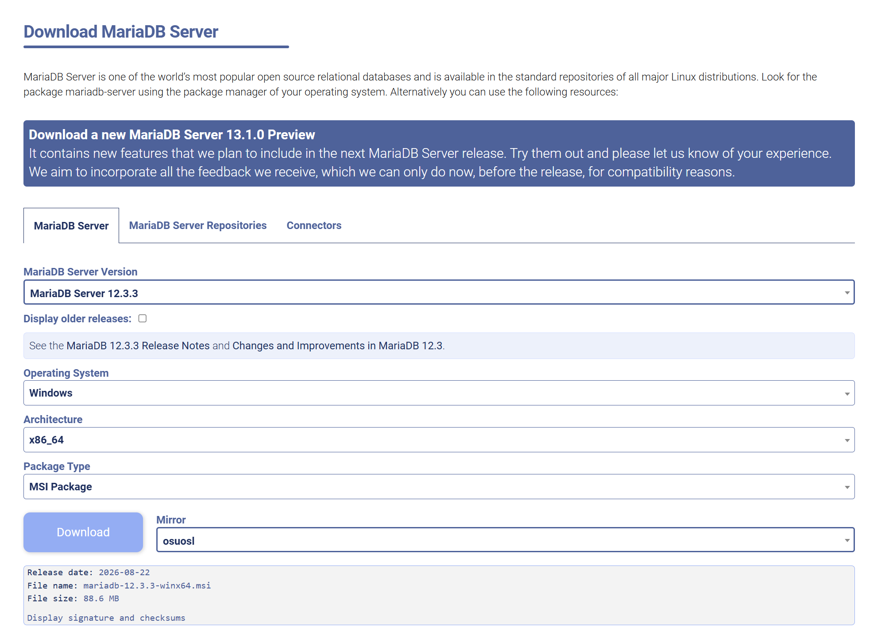
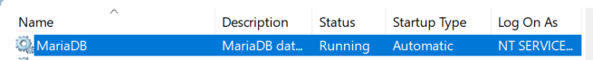
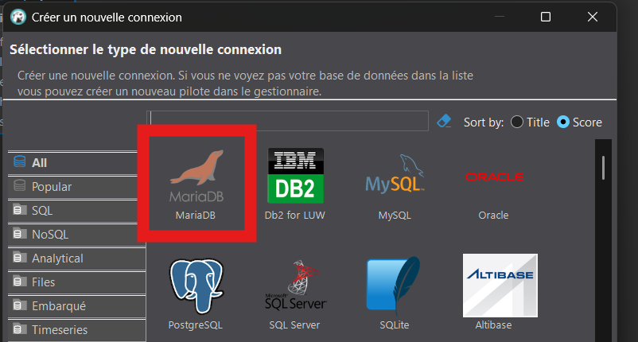
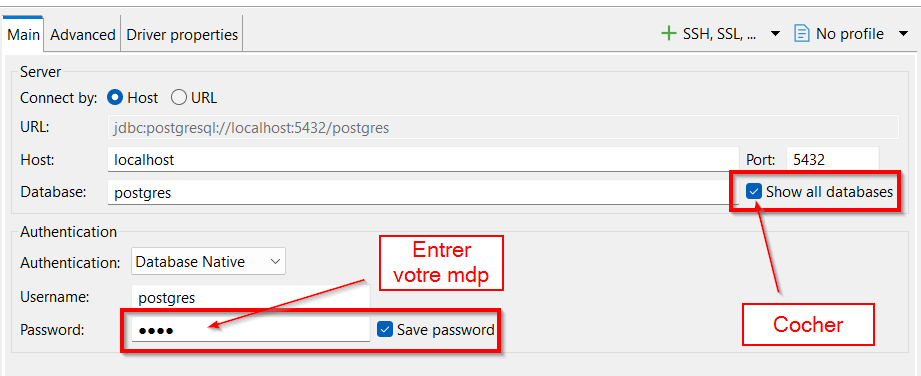
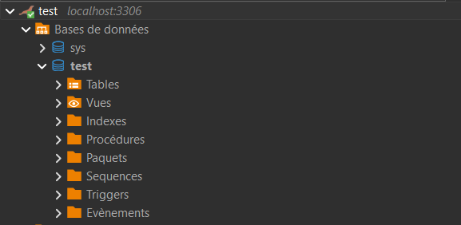
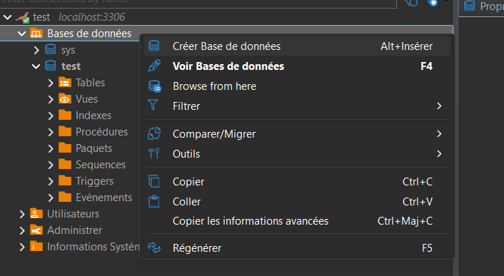
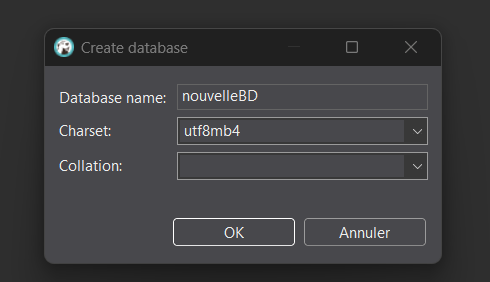
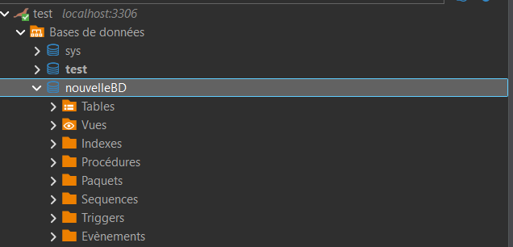

# 🧪 Laboratoire 01 — Installation et création de la base de données


<div class="bg-blue-50 border border-blue-200 text-blue-900 rounded-lg p-4">
<strong>Dans ce laboratoire, vous allez :</strong><br>

1) Installer la base de données MariaDB
2) Installer le client DBeaver
3) Créer une nouvelle connexion MariaDB
4) Créer une nouvelle base de données
</div>

## Prérequis

<div class="bg-yellow-50 border border-yellow-200 text-yellow-900 rounded-lg p-4">

- Windows (instructions testées sur Windows 11)
- Accès administrateur pour installer des programmes

</div>

## 1. Installer MariaDB

1. Téléchargement
	- Rendez-vous sur https://mariadb.org/download/ et téléchargez le paquet **MSI** pour Windows.
    

2. Installation via l'installateur
	- Lancez le fichier `.msi` téléchargé et suivez l'assistant.
	- Composants : laissez les valeurs par défaut (`Database instance` et `Client Programs`).
	  L'outil `HeidiSQL` est optionnel — nous utiliserons DBeaver.
	- Mot de passe : choisissez un mot de passe pour l'utilisateur `root` (superutilisateur).
	- Cochez l'option <strong>Use UTF8 as default server's character set</strong>.
	- Nom du service : `MariaDB` (par défaut).
	- Port : `3306` (par défaut).

3. Vérifier le service MariaDB
    - Appuyer sur la touche `Win + R`
    - Entrer `services.msc`
    - Trouver `MariaDB`
        - 
        - Normalement, le service devrait être lancé et avoir un type de démarrage automatique.
        - Dans le cas contraire, vous pouvez le corriger via clic-droit et propriétés.

4. Vérifier que `mariadb` est accessible dans le PATH

Dans certaines situations, vous utiliserez le client <strong>mariadb</strong> en ligne de commande.  
Il doit donc être accessible via le <strong>PATH de Windows</strong>.

1) Ouvrez <strong>Invite de commandes</strong> ou <strong>PowerShell</strong>  
2) Entrez la commande suivante :

```bash
mariadb --version
```

- Si une version de MariaDB s’affiche, tout est correct.
- Si la commande est introuvable, le client n’est pas dans le PATH.

> La commande `mysql --version` fonctionne aussi : c'est l'ancien nom du même client,
> conservé par MariaDB pour des raisons de compatibilité.

<details id="ajouter-au-path" class="border border-gray-300 rounded-md p-4 my-4 bg-yellow-50 text-gray-800">
  <summary class="cursor-pointer font-semibold">
    Ajouter le client MariaDB au PATH (si nécessaire)
  </summary>

  <div class="mt-4 space-y-3">

- Appuyer sur WIN / START  
- Taper envi et cliquer sur <code>Modifier les variables d’environnement système</code>  
- Cliquer sur <strong>Variables d’environnement</strong>  
- Dans <strong>Variables système</strong>, sélectionner <code>Path</code>  
- Cliquer sur <strong>Nouveau</strong>  
- Ajouter le dossier <code>bin</code> où est installé MariaDB  

Emplacement habituel (le numéro de version peut différer) :

```bash
C:\Program Files\MariaDB 11.8\bin
```


>L'image est petite? Faites un clic-droit et `Ouvrir l'image dans un nouvel onglet`

  </div>
</details>

## 2. Installer DBeaver

DBeaver est un logiciel de gestion de base de données. Il servira à créer et à gérer votre base de données MariaDB.

1. Téléchargement
	- Rendez-vous sur https://dbeaver.io/download/ et téléchargez l'installateur
    - 

2. Installation via l'installateur
	- Lancez le fichier `.exe` téléchargé et suivez l'assistant.
	- Conservez les paramètres par défaut.

## 3. Créer une nouvelle connexion

À cette étape, vous allez connecter **DBeaver** à votre service **MariaDB**.

1) Ouvrir DBeaver.

2) En haut à gauche, cliquer sur `nouvelle connexion`.
    - 

3) Sélectionner la base de données MariaDB.
    - Attention : DBeaver propose aussi `MySQL`. Choisissez bien **MariaDB**.
    - 

4) Confirmer les options de connexion.
    - Serveur : `localhost` — Port : `3306`.
    - Utilisateur : `root`.
    - Entrez le mot de passe que vous avez sélectionné pour l'utilisateur `root` lors de l'installation de MariaDB.
    - Activer l'option **Show all databases** pour voir toutes les bases de données.
    - 

5) Installer les pilotes.
    - Après avoir créé la nouvelle connexion, DBeaver vous proposera de télécharger les pilotes pour MariaDB.
    - Cliquer sur télécharger.
    - 

## 4. Créer une base de données

1) La section de gauche de l'interface de DBeaver correspond au navigateur de connexions et de bases de données. Vous devriez voir apparaître votre connexion à MariaDB que vous venez de créer.
    - 

2) Clic-droit sur `Bases de données` et cliquer sur `Créer base de données`
    - 

3) Nommer la base de données `lab01` et conserver le jeu de caractères `utf8mb4`
    - 

4) Voilà, vous avez maintenant créé votre première base de données. Vous pouvez la conserver ou la supprimer avec clic-droit + supprimer (attention cette action est irréversible --> à ne pas faire pendant vos tps.)
    - 

### 4.1 Création de la base de données par code SQL
<div class="bg-green-50 border-green-500 p-4 mt-4 rounded-s text-green-800">

Cette étape vous montre comment créer exactement la même base de données mais **avec une commande SQL**, au lieu d’utiliser l’interface de DBeaver.
Nous verrons cela plus en détail dans le module 2.

1) Vous devez d'abord ouvrir un **nouvel éditeur SQL** sur votre connexion MariaDB (voir l'image ci-dessous):
  

1) Vous pouvez exécuter cette commande dans l’éditeur SQL de DBeaver.

    <div class="bg-gray-50 border-l-4 border-blue-500 p-4 rounded-s">
    <b>Commande SQL :</b>

    ```sql
    create database lab01;
    ```
    </div>

    

2) Pour voir votre **nouvelle base de données apparaître**, vous devez rafraîchir dans l'explorateur à gauche:
   
   

3) Créer une base de données ne veut pas dire qu'on y travaille. Pour **choisir la base
   active** dans l'éditeur SQL, on utilise la commande `use` :

    <div class="bg-gray-50 border-l-4 border-blue-500 p-4 rounded-s">

    ```sql
    use lab01;
    ```
    </div>

   Toutes les commandes qui suivent s'appliqueront alors à `lab01`.

</div>
