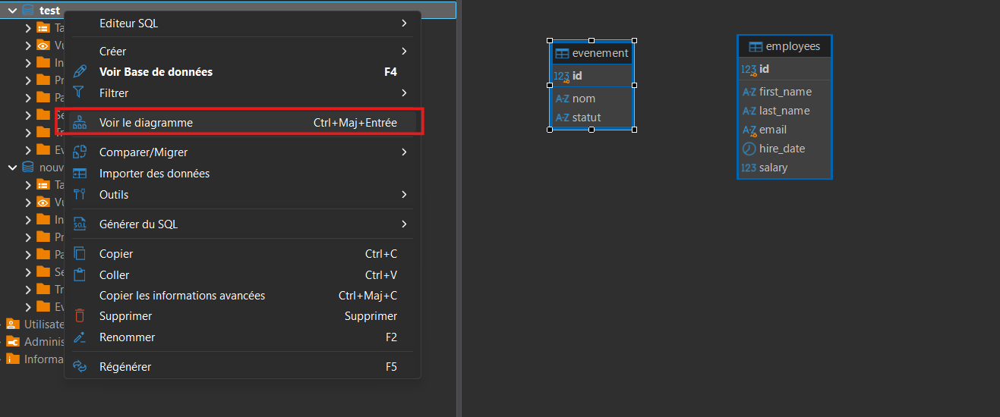

# 05 — Démonstration guidée — Créer une BD, des tables, des contraintes, des clés (PK/FK)

## Objectif de la démo
- Créer une base de données MariaDB.
- Créer des tables liées à un contexte simple (événements).
- Définir des contraintes simples (NOT NULL, UNIQUE, DEFAULT, CHECK).
- Définir des clés primaires (PRIMARY KEY).
- Définir des clés étrangères (FOREIGN KEY).

<iframe width="560" height="315" src="https://www.youtube.com/embed/1FbFcJfxpNs?si=8Agvt-k2uKXZYBAo" title="YouTube video player" frameborder="0" allow="accelerometer; autoplay; clipboard-write; encrypted-media; gyroscope; picture-in-picture; web-share" referrerpolicy="strict-origin-when-cross-origin" allowfullscreen></iframe>

<div class="bg-red-50 border border-red-300 text-red-900 rounded-lg p-4 mt-3">
<strong>⚠️ Vidéo à remplacer</strong><br>
Cette capture vidéo a été enregistrée avec PostgreSQL. La démarche reste la même, mais la
syntaxe montrée à l'écran (<code>serial</code>, absence de <code>use</code>) ne correspond
plus au cours. Fiez-vous au texte de la page.
</div>

<div class="bg-red-50 border border-red-300 text-red-900 rounded-lg p-4 mt-5">
<strong>Important — apprentissage</strong><br>
Pour cette démo, il est essentiel de <strong>taper manuellement</strong> les instructions SQL plutôt que de les copier-coller.<br>
Cela permet de mieux comprendre la syntaxe, d’éviter les erreurs courantes et d’être capable de <strong>reproduire correctement les instructions lors d’un examen</strong>.
</div>

## Aide-mémoire — Création d’une table (DDL)

### Structure générale

```sql
create table nom_table (
    colonne1 type constraint constraint,
    colonne2 type constraint,
    colonne3 type,

    primary key (colonne_pk),
    foreign key (colonne_fk) references table_parent(colonne_pk)
);
```

---

## 1) Créer la base de données

```sql
create database demo_evenements;
```

Il faut ensuite **se placer dans cette base** avant de créer quoi que ce soit :

```sql
use demo_evenements;
```

<div class="bg-yellow-50 border border-yellow-200 text-yellow-900 rounded-lg p-4">
<strong>Action</strong><br>
Sans ce <code>use</code>, MariaDB répondra <code>No database selected</code> à la première
instruction <code>create table</code>.
</div>

---

## 2) Créer la table principale : evenement

```sql
create table evenement (
    id int primary key auto_increment,
    nom varchar(100) not null,
    date_evenement date not null,
    lieu varchar(100) not null,
    capacite integer not null check (capacite >= 0),
    actif boolean not null default true
);
```

<div class="bg-yellow-50 border border-yellow-200 text-yellow-900 rounded-lg p-4">
<strong>Observer</strong><br>
Constater que la clé primaire identifie chaque événement et que les contraintes empêchent des valeurs manquantes ou incohérentes.
</div>

---

## 3) Créer la table : participant

```sql
create table participant (
    id int primary key auto_increment,
    nom varchar(100) not null,
    courriel varchar(150) not null unique,
    actif boolean not null default true
);
```

<div class="bg-yellow-50 border border-yellow-200 text-yellow-900 rounded-lg p-4">
<strong>Justifier</strong><br>
Utiliser <code>UNIQUE</code> sur <code>courriel</code> pour empêcher deux participants d’avoir le même courriel.
</div>

---

## 4) Créer la table de relation : inscription

### Représenter une relation plusieurs-à-plusieurs
- Permettre à un participant de s’inscrire à plusieurs événements.
- Permettre à un événement d’avoir plusieurs participants.

```sql
create table inscription (
    id int primary key auto_increment,
    evenement_id integer not null,
    participant_id integer not null,
    date_inscription date not null default (current_date),

    foreign key (evenement_id) references evenement(id),
    foreign key (participant_id) references participant(id),

    unique (evenement_id, participant_id)
);
```

<div class="bg-blue-50 border border-blue-200 text-blue-900 rounded-lg p-4 mb-5">
<strong>Astuce</strong><br>
<code>CURRENT_DATE</code> permet d'enregistrer la date d'aujourd'hui par défaut.<br>
Notez les <strong>parenthèses</strong> : MariaDB les exige autour d'une expression utilisée
comme valeur par défaut.
</div>

<div class="bg-yellow-50 border border-yellow-200 text-yellow-900 rounded-lg p-4">
<strong>Expliquer</strong><br>

- Utiliser des clés étrangères pour forcer l’existence de l’événement et du participant.<br>
- Utiliser <code>UNIQUE (evenement_id, participant_id)</code> pour empêcher une double inscription au même événement.

</div>

---

## 5) Visualiser le schéma dans DBeaver




>Une fois le schéma ouvert, faites un clic-droit sur une table et sélectionnez la `notation` `crow's foot`.

>Vous pouvez également repositionner les tables pour clarifier l'affichage.

---

<details id="demo-ddl-code" class="mt-6">
<summary class="cursor-pointer font-semibold text-blue-700">
Script complet pour validation
</summary>

## Script complet (exécuter dans l’ordre)

```sql
use demo_evenements;

create table evenement (
    id int primary key auto_increment,
    nom varchar(100) not null,
    date_evenement date not null,
    lieu varchar(100) not null,
    capacite integer not null check (capacite >= 0),
    actif boolean not null default true
);

create table participant (
    id int primary key auto_increment,
    nom varchar(100) not null,
    courriel varchar(150) not null unique,
    actif boolean not null default true
);

create table inscription (
    id int primary key auto_increment,
    evenement_id integer not null,
    participant_id integer not null,
    date_inscription date not null default (current_date),
    foreign key (evenement_id) references evenement(id),
    foreign key (participant_id) references participant(id),
    unique (evenement_id, participant_id)
);
```
</details>

---

## Questions
- Identifier la contrainte qui empêche une capacité négative.
- Identifier la contrainte qui empêche deux participants avec le même courriel.
- Expliquer pourquoi une clé étrangère empêche des incohérences.
- Expliquer l’effet de <code>UNIQUE (evenement_id, participant_id)</code>.

<div class="bg-blue-50 border border-blue-200 text-blue-900 rounded-lg p-4">
<strong>À faire prochainement</strong><br><br>
Faire le <strong>Lab 03 — Modélisation DDL : Concessionnaire automobile</strong>.

[Aller au laboratoire 03](../../labs/lab03-ddl.md)
</div>
