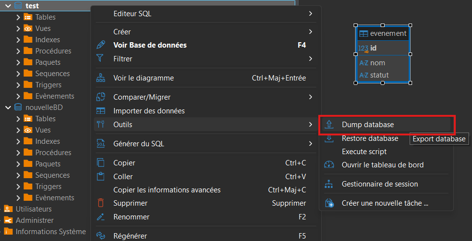
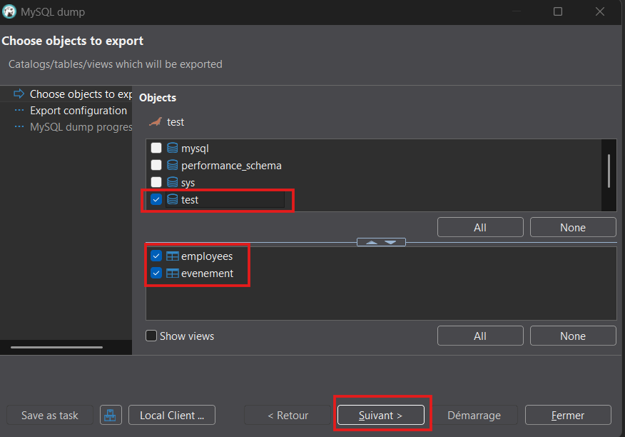
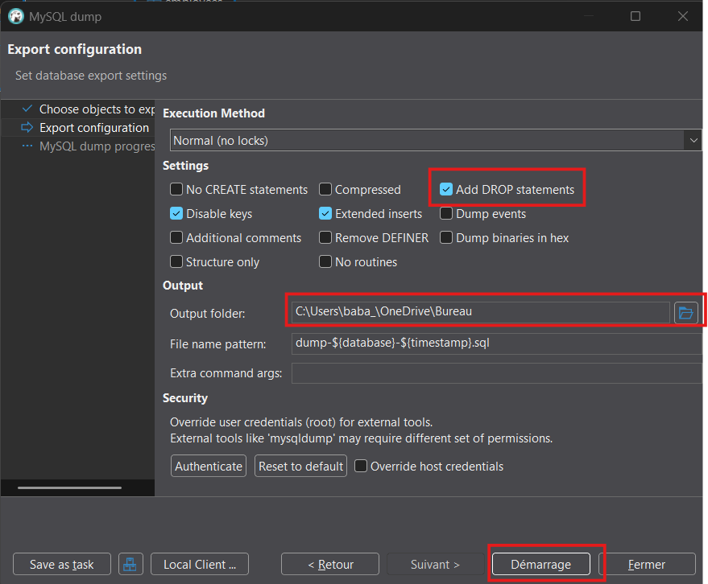
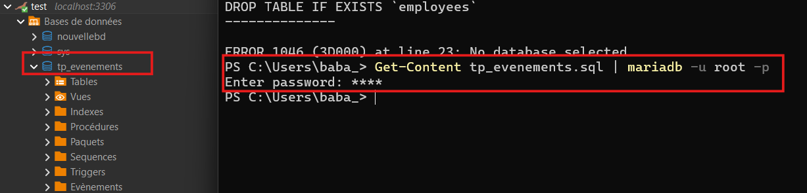

# 07 — Import et export d’une base de données

## Objectif
Savoir **exporter** et **importer une base de données complète** à l’aide de DBeaver afin de :
- sauvegarder un travail
- remettre un projet
- recréer une base de données existante

---

## Exporter une base de données (DBeaver)

Exporter une base de données permet de sauvegarder :
- la structure (tables, contraintes, clés)
- les données

### Étapes d'exportation
- Clic-droit sur la **base de données** dans DBeaver.
- Dans l'option `Outils`, choisir `Dump database`
- Cocher toutes les tables + `Suivant`
- Choisir le `Encoding` en `UTF-8`
- Cocher `Add DROP statements`
- Choisir et noter le `Output folder`
- Démarrage
- Ouvir et valider le fichier `.sql` généré.

<div class="bg-yellow-50 border border-yellow-200 text-yellow-900 rounded-lg p-4 mb-5">
<strong>À retenir</strong><br>
Le fichier exporté doit être un fichier <code>.sql</code> lisible.<br>
C'est normal de ne pas comprendre toutes les instructions qui y sont contenues.
</div>





---

## Compléter le fichier exporté

Le fichier `.sql` généré par DBeaver contient :
- la création des tables, contraintes et clés
- les données

Mais il **ne contient pas** la création de la base de données elle-même, ni la sélection de
celle-ci. Si on l'exécute tel quel, MariaDB répond :

```text
ERROR 1046 (3D000): No database selected
```

### Ce qu'il faut ajouter

Ouvrez le fichier `.sql` dans un éditeur de texte (VS Code, Notepad++, ou DBeaver) et
ajoutez ces **deux lignes tout en haut**, avant tout le reste :

```sql
create database if not exists tp_evenements;
use tp_evenements;
```

<div class="bg-blue-50 border border-blue-200 text-blue-900 rounded-lg p-4 mb-5">
<strong>Ce que ça fait</strong><br>

- <code>create database</code> crée la base si elle n'existe pas déjà. Le
  <code>if not exists</code> évite une erreur si vous réimportez une deuxième fois.
- <code>use</code> indique à MariaDB dans quelle base créer les tables qui suivent.

</div>

<div class="bg-yellow-50 border border-yellow-200 text-yellow-900 rounded-lg p-4 mb-5">
<strong>Pourquoi c'est important</strong><br>
Une fois ces deux lignes ajoutées, le fichier est <strong>autoportant</strong> : il recrée
à lui seul la base complète, sur n'importe quelle machine.<br>
C'est exactement ce qu'on attend d'un fichier remis dans un travail.
</div>

---

## Importer une base de données (ligne de commande)

Le fichier contient maintenant tout ce qu'il faut :
- la création de la base de données (CREATE DATABASE)
- la sélection de la base de données (USE)
- la création des tables, contraintes et données

Il suffit donc **d'exécuter le fichier SQL au complet**.
On le fait en ligne de commande : le fichier contient des centaines d'instructions, et le
client `mariadb` les exécute toutes d'un coup, dans l'ordre.

<div class="bg-yellow-50 border border-yellow-300 text-yellow-900 rounded-lg p-4">
<strong>Avez-vous ajouté le client MariaDB à votre PATH?</strong><br>

[Ajouter le client MariaDB au PATH](../../labs/lab01-installations.md#ajouter-au-path)
</div>

---

### Commande à utiliser

Dans **PowerShell**, à partir du dossier qui contient le fichier `.sql` :

```powershell
Get-Content tp_evenements.sql | mariadb -u root -p
```

Le mot de passe de `root` vous sera demandé après avoir appuyé sur Entrée.

#### Signification des options utilisées

- <code>Get-Content ... |</code> : lit le fichier et l'envoie au client MariaDB.
- <code>-u root</code> : le **nom de l'utilisateur MariaDB** utilisé pour se connecter.
- <code>-p</code> : demande le **mot de passe** de cet utilisateur.

<div class="bg-yellow-50 border border-yellow-200 text-yellow-900 rounded-lg p-4 mb-5">
<strong>Erreur <code>No database selected</code></strong><br>
Vous avez oublié d'ajouter les deux lignes en haut du fichier. Revenez à la section
précédente.
</div>

<div class="bg-red-50 border border-red-300 text-red-900 rounded-lg p-4 mb-5">
<strong>Attention</strong><br>
Le script recrée les tables et écrase les données existantes.<br>
S'assurer que le fichier SQL correspond bien au travail à importer.<br>
Encore une fois, toujours conserver une copie fonctionnelle des instructions que vous avez écrites pour votre travail.
</div>



---

## Démo

- Exporter une base de données avec DBeaver.
- Repérer le fichier <code>.sql</code> généré.
- Ajouter le <code>create database</code> et le <code>use</code> au début du fichier.
- Exécuter le fichier avec <code>mariadb</code>.
- Vérifier que la base de données, les tables et les relations sont recréées.

<div class="bg-yellow-50 border border-yellow-200 text-yellow-900 rounded-lg p-4">
Si vous voulez être vraiment certain que ça fonctionne, supprimez manuellement votre base de données dans DBeaver avant l'exécution de la commande.
</div>

---

## À retenir

<div class="bg-yellow-50 border border-yellow-200 text-yellow-900 rounded-lg p-4">
<ul class="list-disc pl-5">
  <li>Exporter = sauvegarder une base de données</li>
  <li>Importer = recréer une base de données</li>
  <li>L'export de DBeaver <strong>n'inclut pas</strong> le <code>create database</code> ni le <code>use</code> : il faut les ajouter au fichier</li>
  <li>Un fichier bien préparé recrée la base à lui seul, sur n'importe quelle machine</li>
  <li>L'export se fait dans DBeaver, l'import se fait en ligne de commande</li>
</ul>
</div>
