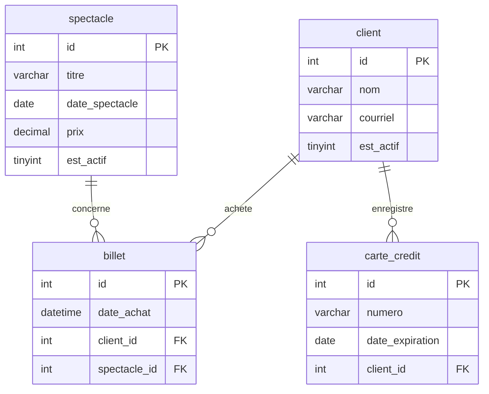

# Révision — Examen 1

## Format

- Examen **sur papier**, en classe.
- Matière : **modules 1 à 3** — tout ce qui a été vu depuis le début de la session
  (modélisation, DDL, SQL).
- Aucun ordinateur : le code SQL s'écrit **à la main**.

<div class="my-6 rounded-lg border border-yellow-300 bg-yellow-50 p-4 text-yellow-900">
<strong>Comment réviser avec cette page</strong><br>
Écrivez chaque réponse <strong>à la main d'abord</strong>, sans DBeaver et sans autocomplétion.
Vérifiez ensuite dans DBeaver.<br>
C'est la seule façon de découvrir ce que vous ne savez pas encore : tant que l'éditeur complète
<code>select</code>, propose les noms de colonnes et souligne les erreurs en rouge, vous ne
savez pas si la syntaxe vient de vous ou de l'outil.
</div>

## Ce qui est évalué

| Partie | Matière | Type de questions |
|---|---|---|
| 1 | Modélisation (module 1) | lire un MRD, cardinalités, PK et FK, construire un modèle à partir de règles d'affaires |
| 2 | DDL (module 2) | `create table`, types, contraintes, corriger un script fautif |
| 3 | SQL (module 3) | `insert`, `select`, opérateurs, sous-requêtes, prédire le résultat d'une requête |

---

## Contexte utilisé dans toute la révision

Une plateforme de diffusion culturelle permet à des clients d'acheter des billets pour assister
à différents spectacles.

Chaque client possède un compte personnel contenant ses informations de contact et peut
enregistrer une ou plusieurs cartes de crédit pour effectuer ses paiements.

Les spectacles sont offerts à des dates précises et comportent un prix fixe.

Lorsqu'un client achète un billet, une transaction est enregistrée afin d'associer ce client au
spectacle choisi.

---

# PARTIE 1 — Modélisation

## 1. Lire un modèle



Répondez sans regarder vos notes :

1. Quelle est la **clé primaire** de chaque table ? À quoi sert-elle ?
2. Quelles sont les **clés étrangères** ? Vers quelle table pointe chacune ?
3. Quel est le **type de relation** (1–N ou N–N) entre :
   - `client` et `billet`
   - `spectacle` et `billet`
   - `client` et `carte_credit`
4. Justifiez chaque réponse par une phrase concrète
   (ex. : « un *client* peut avoir plusieurs *billets*, mais un *billet* appartient à un seul
   *client* »).
5. Quelle table représente une **action** plutôt qu'une chose ? Comment la reconnaît-on ?
6. Où est stockée l'information suivante :
   - le prix payé pour assister à un spectacle
   - la date à laquelle un client a acheté
   - le nombre de spectacles achetés par un client
7. Un client peut-il acheter **deux billets** pour le même spectacle avec ce modèle ?
   Qu'est-ce qui l'empêcherait ou le permettrait ?

## 2. Construire un modèle à partir de règles d'affaires

La plateforme veut maintenant gérer les **salles** où sont présentés les spectacles.

Règles d'affaires :

- Une salle possède un nom, une adresse et un nombre de places.
- Un spectacle est présenté dans **une seule** salle.
- Une salle peut accueillir **plusieurs** spectacles.
- Une salle appartient à un **diffuseur**; un diffuseur peut posséder plusieurs salles.

Sur papier :

1. Ajoutez les tables nécessaires au modèle de la question 1.
2. Donnez les colonnes et leur **type**, en respectant les conventions du cours
   (minuscules, sans accents, singulier, `snake_case`).
3. Indiquez les PK, les FK et les cardinalités.
4. Dans quelle table la FK doit-elle être placée pour la relation salle–spectacle ?
   Pourquoi pas dans l'autre ?

<div class="my-6 rounded-lg border border-blue-300 bg-blue-50 p-4 text-blue-900">
<strong>Le réflexe à avoir</strong><br>
Dans une relation 1–N, la clé étrangère va <strong>toujours du côté N</strong>.
Plusieurs spectacles dans une salle → la FK <code>salle_id</code> va dans
<code>spectacle</code>.
</div>

---

# PARTIE 2 — DDL

## 3. Corriger un script

Le script suivant devait créer la base de la billetterie. Il ne s'exécute pas.

**Trouvez les erreurs (il y en a au moins sept), expliquez-les, puis réécrivez le script au
complet.**

```sql
create database billetterie;

create table billet (
  id serial primary key,
  date_achat time,
  client_id varchar(20),
  foreign key (client_id) references client(id)
);

create type statut_client as enum ('actif', 'suspendu');

create table client (
  id int primary key auto_increment,
  nom varchar,
  courriel varchar(120) unique
  telephone decimal(12,0),
  statut statut_client
);
```

<details class="mt-6">
<summary class="cursor-pointer font-semibold text-red-700">
⚠️ Corrigé — à consulter seulement après avoir cherché
</summary>

1. **Aucun `use billetterie;`** après le `create database`. Sans lui, MariaDB répond
   `No database selected` : la base existe, mais aucune n'est sélectionnée.
2. **`serial` n'existe pas** en MariaDB. On écrit `id int primary key auto_increment`.
   Rappel : une colonne `auto_increment` doit obligatoirement être une clé.
3. **`billet` est créée avant `client`**, mais elle la référence. La table référencée doit
   exister avant la clé étrangère (sinon `errno 150`). On crée `client` d'abord.
4. **`client_id varchar(20)` ne correspond pas au type de `client.id`** (`int`). Une FK doit
   avoir **exactement** le même type que la PK référencée.
5. **`create type ... as enum` n'existe pas** en MariaDB. L'`enum` se déclare **dans la
   colonne** : `statut enum('actif', 'suspendu')`.
6. **`varchar` sans longueur** : il faut `varchar(80)`.
7. **Virgule manquante** après `courriel varchar(120) unique`.
8. **`date_achat time`** ne conserve que l'heure, sans la date. Le type attendu est `datetime`
   (ou `date` si l'heure n'est pas nécessaire).
9. La FK de `billet` vers `spectacle` est absente du script.

```sql
create database billetterie character set utf8mb4;
use billetterie;

create table client (
  id int primary key auto_increment,
  nom varchar(80) not null,
  courriel varchar(120) not null unique,
  telephone decimal(12,0),
  statut enum('actif', 'suspendu') not null default 'actif'
);

create table spectacle (
  id int primary key auto_increment,
  titre varchar(100) not null,
  date_spectacle date not null,
  prix decimal(8,2) not null,
  est_actif boolean not null default true
);

create table billet (
  id int primary key auto_increment,
  date_achat datetime not null,
  client_id int not null,
  spectacle_id int not null,
  foreign key (client_id) references client(id),
  foreign key (spectacle_id) references spectacle(id)
);
```

</details>

## 4. Écrire un `create table` complet

Sans regarder le corrigé de la question 3, écrivez **à la main** la table `carte_credit` :

- une clé primaire auto-incrémentée;
- le numéro de la carte, sa date d'expiration, son code de vérification;
- une référence vers le client propriétaire;
- les contraintes qui vous semblent pertinentes.

Questions à vous poser en écrivant :

- Quel type pour un numéro de carte ? (Attention au piège : un numéro de carte n'est pas un
  nombre sur lequel on calcule, et il peut commencer par un zéro.)
- Que se passe-t-il si on supprime un client qui possède une carte ?
- Le script doit-il commencer par quelque chose ?

---

# PARTIE 3 — SQL

## 5. Prédire le résultat d'une requête

C'est le type de question qu'on ne peut pas pratiquer en tapant du code : il faut **lire** et
**raisonner**.

Table `spectacle` :

| id | titre | ville | prix | est_actif |
|---:|---|---|---:|---:|
| 1 | Cirque du Soir | Québec | 45.00 | 1 |
| 2 | Jazz au Parc | Montréal | 0.00 | 1 |
| 3 | Théâtre d'Été | Québec | 32.50 | 0 |
| 4 | Concert Métal | Montréal | 75.00 | 1 |
| 5 | Danse Contemporaine | Lévis | 45.00 | 0 |

Table `billet` :

| id | spectacle_id | client_id |
|---:|---:|---:|
| 1 | 1 | 1 |
| 2 | 1 | 2 |
| 3 | 4 | 1 |
| 4 | 2 | 3 |

Pour chacune des requêtes, écrivez **les lignes retournées, dans l'ordre**.

```sql
-- a)
select titre
from spectacle
where prix between 30 and 50
order by titre;
```

```sql
-- b)
select distinct ville
from spectacle
where est_actif = true;
```

```sql
-- c)
select titre
from spectacle
where titre like '%é%';
```

```sql
-- d)
select titre
from spectacle
where id not in (
  select spectacle_id
  from billet
);
```

```sql
-- e)
select titre
from spectacle
where est_actif = true
and ville = 'quebec';
```

<details class="mt-6">
<summary class="cursor-pointer font-semibold text-red-700">
⚠️ Corrigé — à consulter seulement après avoir répondu
</summary>

**a)** `Cirque du Soir`, `Danse Contemporaine`, `Théâtre d'Été`.
`between` est inclusif et porte sur 30 **et** 50. Les trois spectacles à 45,00 $, 32,50 $ et
45,00 $ sont retenus, puis triés alphabétiquement — le tri est sur le **titre**, pas sur le prix.

**b)** `Québec`, `Montréal`.
Seules les lignes actives (1, 2, 4) sont lues, ce qui donne Québec, Montréal, Montréal.
`distinct` élimine le doublon. Sans `order by`, l'ordre n'est pas garanti.

**c)** `Cirque du Soir`, `Théâtre d'Été`, `Concert Métal`, `Danse Contemporaine` — soit **tout
sauf** `Jazz au Parc`.
C'est le piège : la collation par défaut de MariaDB est **insensible aux accents**, donc
`'%é%'` retrouve aussi les `e` sans accent. Seul « Jazz au Parc » ne contient aucun `e`.

**d)** `Théâtre d'Été`, `Danse Contemporaine`.
La sous-requête retourne d'abord les `spectacle_id` présents dans `billet` (1, 1, 4, 2), puis la
requête principale garde les spectacles dont l'`id` n'y figure pas : 3 et 5.

**e)** `Cirque du Soir`.
La collation est aussi **insensible à la casse et aux accents** pour l'opérateur `=` :
`'quebec'` retrouve `'Québec'`. Le spectacle 3 est à Québec lui aussi, mais il est inactif.

</details>

## 6. Écrire des requêtes

Reprenez le modèle de la partie 1 et écrivez les requêtes suivantes **à la main**.

### Insertion

1. Insérer un client, en omettant les colonnes qui ont une valeur par défaut ou automatique.
2. Insérer trois spectacles en une seule instruction.
3. Insérer un billet qui référence un client et un spectacle existants.
   Que se passe-t-il si le `client_id` n'existe pas ? Quel message obtient-on ?

### Sélection

4. Les spectacles **actifs** dont le prix se situe **entre 50 $ et 100 $**.
5. Les spectacles dont le titre **ne contient pas** un mot de votre choix.
6. La liste **distincte** des dates de spectacle, de la plus récente à la plus ancienne.
7. Les clients dont le courriel se termine par `@gmail.com`.
8. Les spectacles dont le prix est **supérieur à au moins un** spectacle présenté à Québec.

### Sous-requête non corrélée

9. Les clients (nom et courriel) qui ont acheté **au moins un billet** pour un spectacle coûtant
   plus de 75 $.
10. Les spectacles qui **n'ont reçu aucun billet**.

### Modification et suppression

11. Désactiver tous les spectacles répondant à une combinaison de critères de votre choix,
    en utilisant `and` et `between`.
12. Supprimer les clients inactifs qui n'ont **jamais** acheté de billet
    (la solution doit utiliser une sous-requête).

<div class="my-6 rounded-lg border border-red-300 bg-red-50 p-4 text-red-900">
<strong>Le réflexe qui sauve des points</strong><br>
Avant d'écrire un <code>update</code> ou un <code>delete</code>, écrivez d'abord le
<code>select</code> qui retourne exactement les lignes visées. Si le <code>select</code> retourne
les bonnes lignes, le <code>where</code> est bon — il ne reste qu'à changer le début de la
requête. À l'examen, un <code>delete</code> sans <code>where</code> coûte tous les points de la
question.
</div>

---

## Vérification finale

Une fois la révision faite sur papier, retapez vos réponses dans DBeaver et vérifiez que le
script s'exécute **du début à la fin sans erreur** sur une base vide. Les écarts entre ce que
vous aviez écrit à la main et ce qui fonctionne réellement sont exactement ce qu'il vous reste
à réviser.
